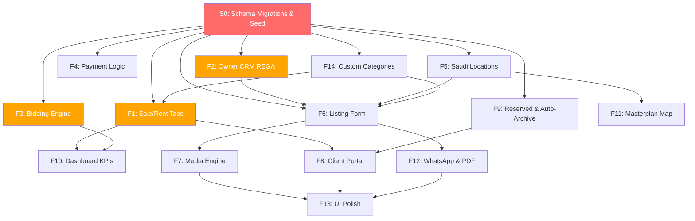

# 📐 Falz Real Estate SaaS — Implementation Plan

**Project:** Falz Real Estate SaaS Platform  
**Phase:** SDLC Phase 4 (Work Planning & Sprint Breakdown)  
**Last Updated:** 2026-08-05  

---

## 1. Git Strategy

### Branching Model
```
main (production-ready)
 └── develop (integration branch)
      ├── feature/S0-schema-migrations
      ├── feature/F1-sale-rent-tabs
      ├── feature/F2-owner-crm-rega
      ├── feature/F3-bidding-engine
      ├── ...
      └── feature/F14-custom-categories
```

### Branch Rules
- **Branch naming:** `feature/F{N}-{short-name}` (e.g., `feature/F3-bidding-engine`)
- **Commit convention:** `feat(F3): add bid auto-hide timer dropdown`
- **Merge flow:** `feature/* → develop → main`
- **One PR per feature** — squash-merge to `develop`
- **Tag per release:** `v0.{sprint}.0` (e.g., `v0.1.0` after Sprint 1)

### PR Documentation Template
Every PR must include:
```markdown
## Feature: F{N} — {Feature Name}
**PRD Module:** Module {N} in 04. Detailed-PRD.md

### Changes
- [ ] Schema migration applied
- [ ] API endpoints added/modified
- [ ] UI components created/updated
- [ ] Arabic wording verified against dictionary

### Screenshots/Recording
(attach UI screenshots or Loom recording)

### Database Migrations
(list Prisma migration files created)

### Testing
- [ ] Acceptance criteria from PRD verified
- [ ] RTL layout tested
- [ ] Zero-value hiding verified on public views
```

---

## 2. Dependency Map



### Dependency Summary Table

| Feature | Depends On | Blocks |
|---------|-----------|--------|
| **S0** (Schema) | Nothing | Everything |
| **F1** (Sale/Rent Tabs) | S0 | F8, F10 |
| **F2** (Owner CRM) | S0 | F6 |
| **F3** (Bidding) | S0 | F10 |
| **F4** (Payment Logic) | S0 | — |
| **F5** (Saudi Locations) | S0 | F6, F11 |
| **F6** (Listing Form) | S0, F2, F5, F14 | F7, F12 |
| **F7** (Media) | F6 | F13 |
| **F8** (Client Portal) | F1, F9 | F13 |
| **F9** (Reserved/Archive) | S0 | F8 |
| **F10** (Dashboard) | F1, F3 | — |
| **F11** (Masterplan) | F5 | — |
| **F12** (WhatsApp/PDF) | F6 | F13 |
| **F13** (UI Polish) | F7, F8, F12 | — |
| **F14** (Custom Categories) | S0 | F1, F6 |

---

## 3. Sprint Plan

### Sprint 0: Foundation (Schema & Seed)
**Goal:** All database migrations and seed data in place. No feature logic.  
**Branch:** `feature/S0-schema-migrations`  
**Estimated effort:** S (Small)

| Task | Detail |
|------|--------|
| Add `RESERVED` to `Availability` enum | 1 value addition |
| Add `EntryType` enum | `PRIVATE`, `SHARED` |
| Add `BidAutoHideDuration` enum | 6 values |
| Add Property fields | `masterBedrooms`, `entryType`, `autoArchiveOnExpiry`, `showBidDate`, `bidAutoHideDuration`, `reservedAt`, `saudiCityId`, `saudiDistrictId` |
| Create `SaudiCity` model | `id`, `name`, `nameAr`, `region` |
| Create `SaudiDistrict` model | `id`, `cityId`, `officeId`, `name`, `nameAr`, `direction` |
| Add `saudiDistricts` relation to `Office` | Inverse relation |
| Seed Saudi cities | All major Saudi cities with Arabic names |
| Seed districts per city | Major districts with direction assignments |
| Run `prisma migrate dev` | Generate & apply migration |
| Update `Plan.maxMediaPerListing` | Change from 5 to 100 |

**Deliverable:** Clean migration + seed script. All subsequent features can build on this.

---

### Sprint 1: Core Navigation & Data Foundation
**Goal:** Sale/Rent isolation, Owner CRM enforcement, Custom categories, Payment filter logic.  
**Features:** F1, F2, F4, F14  
**Estimated effort:** L (Large)

#### F1 — Sale/Rent Tab Separation
| Task | Detail |
|------|--------|
| Add tab bar component to Properties page | `للبيع` \| `للإيجار` tabs using Radix Tabs |
| Wire tab state to API query `dealType` param | Active tab determines query filter |
| Ensure all existing filters work within active tab | Filter bar scoped to active `dealType` |
| Update sidebar "العقارات" link behavior | Opens properties with `للبيع` active |
| Update URL state | Tab selection reflected in URL (`?tab=sale` / `?tab=rent`) |

#### F2 — Owner CRM REGA Enforcement
| Task | Detail |
|------|--------|
| Add Zod validation for `nationalId` and `dob` as required | Form-level enforcement |
| Update Quick-Add Owner modal with REGA error messages | Arabic validation messages |
| Position owner selector at TOP of listing form | Move from current position |
| Verify owner management page at `/dashboard/properties/owners` | Ensure existing page works with new validation |

#### F4 — Payment Filter Logic
| Task | Detail |
|------|--------|
| Update filter logic: Cash returns ALL, Bank returns BANK_AND_CASH only | Backend query change |
| Update filter UI labels | `كاش فقط` / `يقبل البنك` |

#### F14 — Custom Category/Classification Management
| Task | Detail |
|------|--------|
| Add "+ إضافة تصنيف عقاري مخصص" button to subtype selector | Inline modal |
| Scope subtypes by selected category (Residential/Commercial/Agricultural) | Dynamic filtering |
| Role-gate: Only OWNER/MANAGER can add | Permission check |
| Auto-sync new subtypes with filter bar | React Query invalidation |

**Tag:** `v0.1.0`

---

### Sprint 2: Bidding & Location Engine
**Goal:** Full bidding system with auto-hide/date toggles. Saudi locations with managed districts.  
**Features:** F3, F5  
**Estimated effort:** L (Large)

#### F3 — Bidding Engine (Som)
| Task | Detail |
|------|--------|
| Add `bidAutoHideDuration` dropdown to listing form | 6 options + NONE default |
| Add `showBidDate` toggle to listing form | Default OFF |
| Implement bid auto-hide logic on public API | Compare `bidDate` + duration vs `now()` |
| Public view: show "يوجد سوم" when bid is auto-hidden | Replace amount with text |
| Public view: hide bid date when toggle is OFF | Conditional rendering |
| Staff view: always show all bid data | No filtering on dashboard |
| Support backdated bids (`bidDate` editable on form) | Manual date input |

#### F5 — Saudi Locations Engine
| Task | Detail |
|------|--------|
| Create `/api/locations/cities` endpoint | Return pre-seeded cities |
| Create `/api/locations/districts?cityId=` endpoint | Return system + office custom districts |
| Create `POST /api/locations/districts` endpoint | OWNER/MANAGER only, creates under office |
| Build city dropdown (locked, no add option) | Searchable select |
| Build district dropdown with "+ إضافة حي" button | Role-gated add button |
| Auto-set direction when district is selected | Pre-fill from `SaudiDistrict.direction` |
| Allow manual direction override | Editable direction field |
| Replace existing raw string city/district fields in property form | Wire to new models |

**Tag:** `v0.2.0`

---

### Sprint 3: Listing Form & Operations
**Goal:** Enhanced listing form with conditional fields. Reserved status and auto-archive.  
**Features:** F6, F9  
**Estimated effort:** L (Large)

#### F6 — Listing Form Enhancements
| Task | Detail |
|------|--------|
| Add `masterBedrooms` counter field | Alongside existing `bedrooms` |
| Implement `bathrooms >= masterBedrooms` constraint | Zod + UI validation |
| Auto-suggest bathrooms = `bedrooms + 1` | On bedroom change |
| Add `entryType` dropdown for apartments | Conditional on `propertyType == APARTMENT` |
| Implement conditional field visibility per type | Land hides bedrooms/bathrooms/etc. |
| Add comma/decimal normalization for dimension inputs | Accept `.`, `,`, `٫` → Float |
| Add optional spec fields (street width, age, floor, building area) | Already in schema, wire to form |

#### F9 — Reserved Status & Auto-Archive
| Task | Detail |
|------|--------|
| Add `RESERVED` to availability status selector in dashboard | New status option |
| Show "محجوز" badge on public property cards | Conditional badge |
| Disable bid/request buttons on reserved listings (public) | UI + API guard |
| Add `autoArchiveOnExpiry` toggle to listing form | Default ON |
| Build expiry check logic (cron or on-demand) | Check `contractExpiryDate < now()` |
| Send in-app notification on archive or warning | Use existing `Notification` model |
| Record `reservedAt` timestamp on status change | Auto-set on RESERVED transition |

**Tag:** `v0.3.0`

---

### Sprint 4: Media, Client Portal & Dashboard
**Goal:** Photo upload pipeline, visitor accounts, and dashboard analytics.  
**Features:** F7, F8, F10  
**Estimated effort:** XL (Extra Large)

#### F7 — Media Engine
| Task | Detail |
|------|--------|
| Update upload endpoint: 5MB limit, JPEG/PNG/WebP/HEIC | Validation |
| Implement `sharp` compression pipeline (1920px, 80% quality) | Server-side |
| Dual S3 storage (original + compressed) | Two keys per image |
| Enforce 100 photo limit per property | Count check before upload |
| Drag-and-drop photo reorder | Update `sortOrder` via PATCH |
| YouTube/Vimeo URL detection and embed rendering | Regex + iframe |
| HEIC to JPEG/WebP conversion | Via `sharp` |

#### F8 — Client Portal (Visitor System)
| Task | Detail |
|------|--------|
| Build visitor registration page (phone-based) | `/[slug]/register` |
| Build visitor login page | `/[slug]/login` |
| Build favorites page | `/[slug]/favorites` |
| Build request tracking page | `/[slug]/requests` |
| Sanitize all public API responses | Strip `internalNotes`, bidder details, owner records |
| Ensure RESERVED properties block request submission | API guard |

#### F10 — Dashboard KPIs & Analytics
| Task | Detail |
|------|--------|
| Build KPI card: Total Active/Draft/Archived by category | Aggregate query |
| Build KPI card: Total Owners, Total Active Bids | Count queries |
| Build KPI card: Current Month Sales + % change | Aggregate + comparison |
| Build KPI card: Current Quarter Sales | Dynamic Q1-Q4 |
| Build KPI card: Conversion Rate | `(deals / inquiries) × 100` |
| Build Latest Listings table (10 recent) | Simple query + table |
| Build Latest Bids log (real-time) | Query + internal-only fields |

**Tag:** `v0.4.0`

---

### Sprint 5: Advanced Features & Polish
**Goal:** Masterplan map, WhatsApp/PDF generators, and final UI polish.  
**Features:** F11, F12, F13  
**Estimated effort:** XL (Extra Large)

#### F11 — Interactive Parcel/Masterplan Map
| Task | Detail |
|------|--------|
| Extend Leaflet map with GeoJSON polygon layer support | Polygon rendering |
| Implement color-coding by availability status | Green/Yellow/Red/Blue |
| Build click handler for parcel info popup | Card with specs + link |
| Build admin upload for GeoJSON masterplan files | File upload + parse |
| Build admin polygon drawing tool (optional) | Leaflet Draw plugin |

#### F12 — WhatsApp Copy Text & PDF Brochure
| Task | Detail |
|------|--------|
| Build WhatsApp text generator function | Format Arabic marketing text |
| Add "نسخ العرض للواتساب" button to property table + detail | Clipboard copy |
| Build PDF brochure generator using `jspdf` | Photos, specs, branding |
| Add QR code to PDF (link to public page) | QR library |
| Add office logo + FAL license to PDF header | Brand template |

#### F13 — UI Polish
| Task | Detail |
|------|--------|
| Restyle all Radix Switch components | Theme color, 44px, state labels |
| Implement zero-value hiding across all public views | Check all property cards + detail |
| Verify Arabic wording matches dictionary (60+ entries) | Full audit |
| Verify RTL layout on all new components | Visual check |
| Implement filter option auto-sync on mutations | React Query invalidation |

**Tag:** `v0.5.0`

---

## 4. Effort Summary

| Sprint | Features | Size | Priority |
|--------|----------|------|----------|
| Sprint 0 | Schema + Seed | S | P0 |
| Sprint 1 | F1, F2, F4, F14 | L | P0-P1 |
| Sprint 2 | F3, F5 | L | P0-P1 |
| Sprint 3 | F6, F9 | L | P1 |
| Sprint 4 | F7, F8, F10 | XL | P1-P2 |
| Sprint 5 | F11, F12, F13 | XL | P2-P3 |

**Total: 6 sprints (S0-S5)**

---

## 5. Risk Mitigation

| Risk | Mitigation |
|------|-----------|
| Schema migration breaks existing data | Run migration on dev DB first. Back up production before applying. |
| Saudi city/district seed data incomplete | Start with major cities (Riyadh, Jeddah, Dammam, Buraidah, Makkah, Madinah). Add more incrementally. |
| GIS/Masterplan complexity (F11) | Deprioritized to Sprint 5. Can be deferred or phased. Core features ship without it. |
| S3 compression pipeline performance | Process images asynchronously. Return success to user immediately, compress in background. |
| REGA field enforcement on existing owners | Migration: Don't retroactively enforce. Only enforce on new owner creation/edits going forward. |
